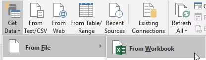
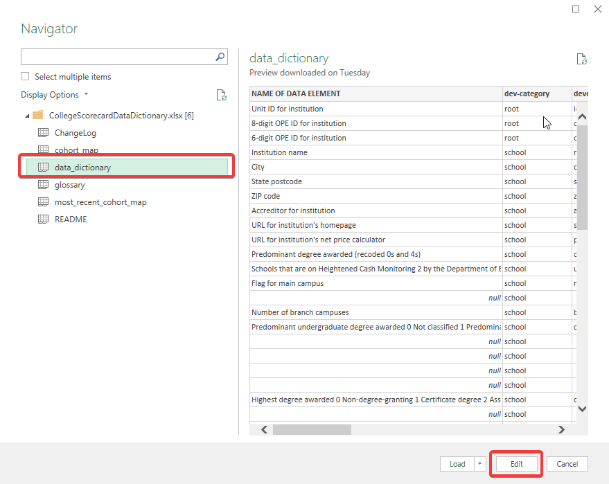
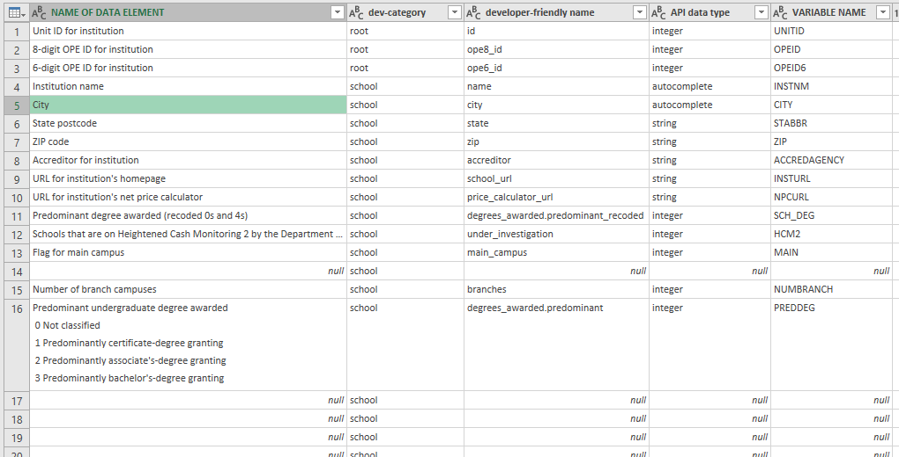
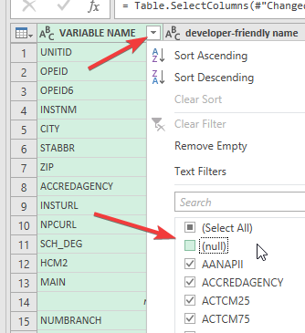
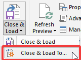
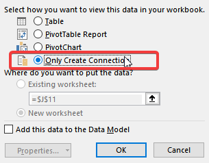

# Reading and Grouping

With Power Query [ready](https://www.excelcampus.com/install-power-query/), we begin by loading the college scorecard data dictionary.

1. First, we load the file from workbook

   

2. Select the dictionary sheet and then `edit`

   
   
3. When selecting and then removing other columns, the order that we select them will become the new order as shown below

   
   
4. Next we remove `null` values from the `VARIABLE NAME` column by unselecting from the filter dropdown.

    
	
5. We want to `Load To` which will only create a connection to this file and store the steps we just built. It will not load the file into our workbook. This allows us to reference external data without first loading it into our spreadsheet. Note this if choosing to send this workbook to others.

	
	
6. We finalize the `load to` by selecting `Only Create Connection`

	
