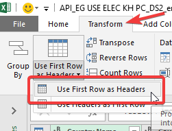
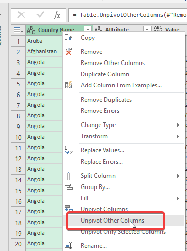
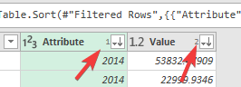
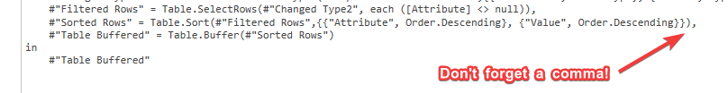
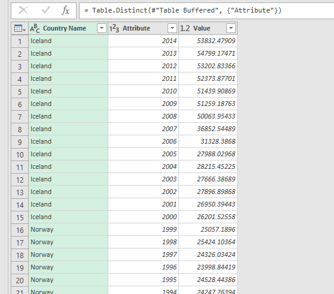

### What question are we solving? 
### "Since 1960, by year, which country has had the largest per capita electrical energy consumption?"

If you are new to Power Query I strongly recommend viewing [Part 1](https://github.com/click-here/Pandas-vs-Power-Query/tree/master/Part1#reading-and-grouping) as this tutorial will assume some basic knowledge explained in Part 1.

### Loading from the Web

1. Assuming you have not cloned this project locally you can grab the requisite data from the web [here](https://raw.githubusercontent.com/click-here/Pandas-vs-Power-Query/master/Part2/API_EG.USE.ELEC.KH.PC_DS2_en_csv_v2_10034224.csv). Just paste the full link to complete this step.

	

2. Remove the top 4 rows to get rid of the unneeded headings.

	
	
3. Promote row 1 so that it becomes our headers.

	
	
4. Remove these columns: "Country Code", "Indicator Name", "Indicator Code"

5. Right click on "Country Name" and select "Unpivot Other Columns".

	
	
Woah, what just happened? Unpivoting allows us to normalize our data. What is normalized data? Well notice our result now has 3 columns each of which is one kind of data: Country, Year, kWh per capita.  This is much easier to work with.

6. We are going to remove duplicates on the year column and we don't want to keep countries with null years. So filter them out of our year column.

7. Sort both the Year and kWh columns descending. Sort order doesn't matter for this task but it is useful to know that PowerQuery shows sort order, pictured below.

	
	
When removing duplicates on a column, Power Query keeps the first result which is why we sorted descending. We want to keep the greatest consumption per capita.  Consider the example below. If we remove duplicates on "Header1".

| Header1  | Header2 |
| ------------- | ------------- |
| a  | 1  |
| a  | 2  |
| a  | 3  |

We'll be left with:

| Header1  | Header2 |
| ------------- | ------------- |
| a  | 1  |

Here's the kicker regarding removal of duplicates in Power Query. It does not respect our sort unless we first buffer the table.  As far as I know you can only add this command via the advanced editor.

8. Go into the Advanced Editor (on the View tab) and add the following under the last row *before* the **"in"** line.  `#"Table Buffered" = Table.Buffer(#"Sorted Rows")` 

What does this mean? We are taking the last state of the data and wrapping it in the `Table.Buffer` method and 'saving' the result to a 'variable' called `#"Table Buffered"`

We also need to modify the last line to return `#"Table Buffered"`

	
9. Lastly right click on the year column and remove duplicates. 

Now we are left with one row per year where the country listed had the highest kWh per capita.

### Having issues with the query?
Get the final mcode [here](https://github.com/click-here/Pandas-vs-Power-Query/blob/master/Part2/Query.m). Just paste into the advanced editor. Better yet. [Diff](https://www.diffchecker.com/) your code alongside mine and see what you missed!

Data From the World Bank: https://data.worldbank.org/indicator/EG.USE.ELEC.KH.PC
